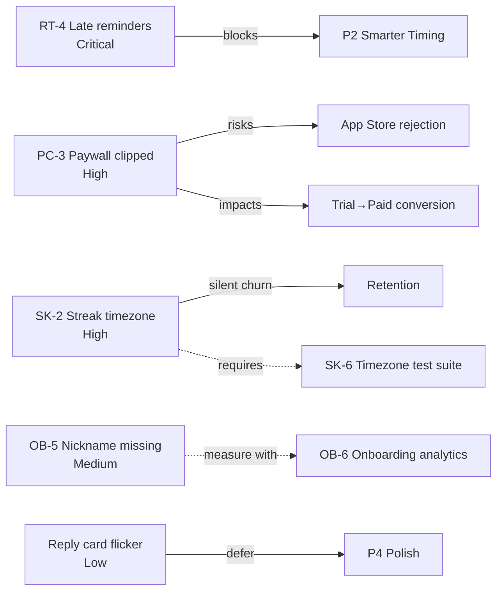

# Bug Triage Decisions — 2026-04-17

DevOps-led review of `bug-triage.csv` against the four trust vectors that define this product: **reminders, onboarding, subscription, and retention**. A bug that breaks one of those is a release blocker, regardless of how small it looks.

## Severity Rubric

| Severity | Definition | Release Posture |
|----------|------------|-----------------|
| Critical | Breaks the core promise (reminders fire on time) or makes the app unusable | Block all releases until fixed or de-risked |
| High | Damages a trust vector (subscription, retention, onboarding) at scale | Must be in the next shipping sprint; cannot slip a major release |
| Medium | Degrades quality of a trust vector but does not silently churn users | Fix in current quarter; pair with measurement |
| Low | Cosmetic; no trust vector impact | Backlog; revisit only when capacity is genuinely free |

## Ranked Fix Order

1. **RT-4 — Late reminders** (Critical). Wait for CTO root-cause findings on Apr 18, then scope. Likely a server-triggered push architecture — that is a P2 expansion, not a patch. **Nothing in P2 ships before this resolves.**
2. **PC-3 — Clipped paywall dismiss** (High). Ship this sprint. Sub-day fix, App Store rejection risk, direct conversion impact. No reason to wait.
3. **SK-2 — Streak resets on timezone change** (High). Ship with SK-6 test suite in the same release. Do not split — silent retention bugs are the worst kind because they never reach support.
4. **OB-5 — Missing nickname in setup** (Medium). Pair with OB-6 analytics so we have a clean baseline. Same sprint.
5. **Reply card flicker** (Low). Stays in P4 backlog.

## What Should Be Fixed Next

After PC-3 lands this sprint, the **next high-leverage fix is RT-4** — assuming CTO findings on Apr 18 confirm the server-push direction. RT-4 is the only Critical, the only one with zero current telemetry, and the gating dependency for P2 (Smarter Timing). Every other open bug is either bounded scope (PC-3, OB-5) or already has a known fix path (SK-2).

## DevOps Preconditions Before Any of These Ship

- **Crash-free baseline snapshot** must be recorded before the first rollout (gap from `monitoring-requirements.md`)
- **Alerting channel** must exist — even a Slack webhook — so a regression after deploy is noticed inside hours, not days
- **OB-6 analytics** ships before or with OB-5 so onboarding funnel changes are measurable
- **SK-6 timezone test suite** ships with SK-2 — not after

## Risk Map

## Open Questions for CTO / PM

- RT-4: do we have *any* device-side delivery telemetry today, or are we entirely blind?
- PC-3: has the paywall fix been verified on the smallest supported device (iPhone SE 2nd gen)?
- SK-2: is the UTC migration backwards-compatible with existing on-device streak data, or does it need a one-time recalculation on app open?
